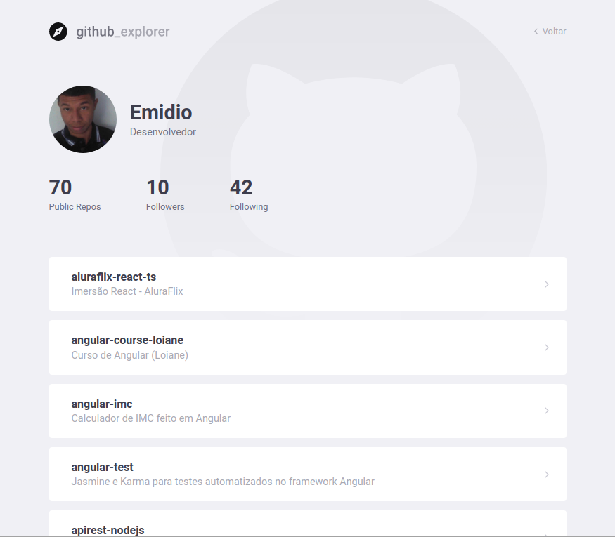
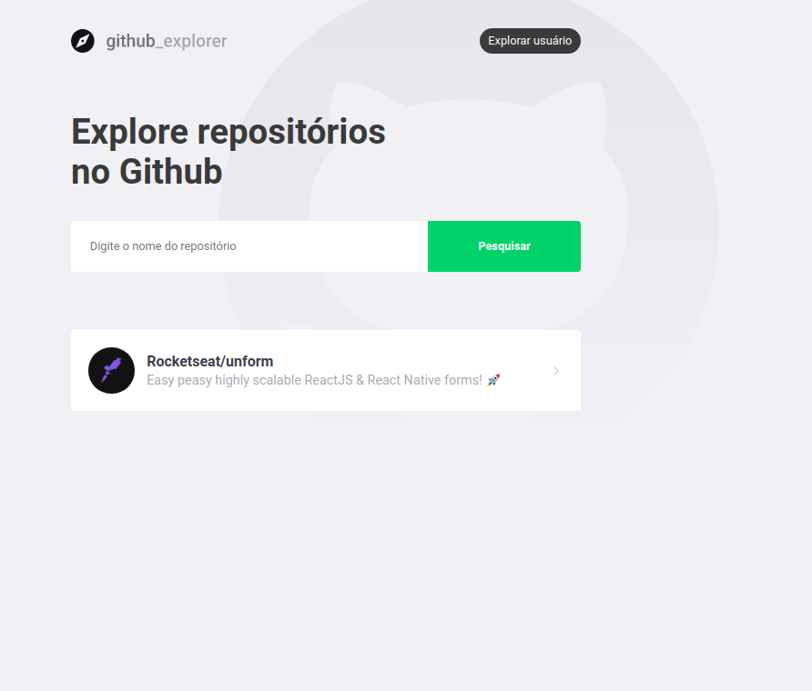
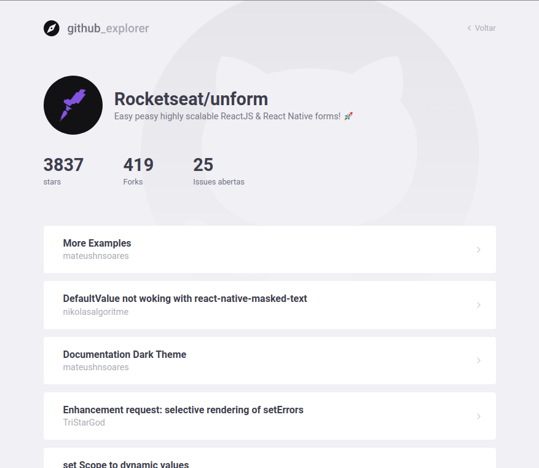

# Github Explorer


<p align="center">
  

  

  <a href="https://github.com/vitorsemidio-dev/github-explorer-ts/commits/master">
    
  </a>

   
</p>

## Sobre o projeto

Aplicação desenvolvida em ReactJS e consumindo dados da API do Github para buscar usuários e repositórios.

## 🧭 Como rodar o projeto

```bash

# Clone este repositório
$ git clone https://github.com/vitorsemidio-dev/github-explorer-ts

# Acesse a pasta do projeto no seu terminal/cmd
$ cd github-explorer-ts

# Instale as dependências
$ yarn install

# Execute a aplicação em modo de desenvolvimento
$ yarn start

# A aplicação será aberta na porta:3000 - acesse http://localhost:3000

```

## Imagens do Projeto

### Usuário

<p align="center">
  
</p>

<p align="center">
  
</p>

### Repositórios

<p align="center">
  
</p>

<p align="center">
  
</p>

<a name="-autor"></a>

## 🦸‍♂️ **Autor**

<p>
<kbd>
 
 </kbd>
 <br />
 <sub><strong>🌟 Vitor Emídio 🌟</strong></sub>
</p>

[](https://www.linkedin.com/in/vitorsemidio/)
[](https://github.com/vitorsemidio-dev)
